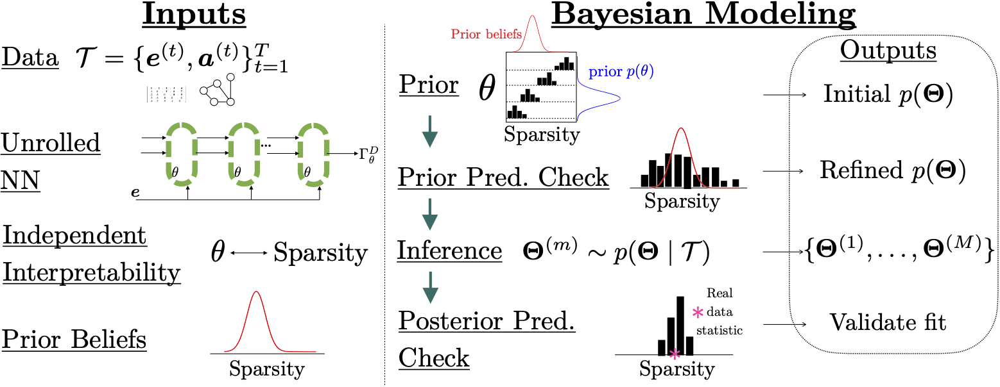

# Graph Structure Learning with Interpretable Bayesian Neural Networks

Repository containing code for the paper ["Graph Structure Learning with Interpretable Bayesian Neural Networks"](https://arxiv.org/abs/2406.14786)

 

  
   
  <em>DPG: The Graph Structure Learning neural network with independently interpretable parameters.</em>

  

  
   
  <em>Bayesian Modeling Workflow.</em>

  

  
   
  <em>Prior and Posterior Predictive Checking.</em>

 

  
   
  <em>Subjective Evaluation on Synthetic Data.</em>

 

For a gentle introduction to performing Bayesian inference on synthetics with DPG, see the [notebook](notebooks/simple_dpg_example.ipynb). You may first need to create the synthetic data; refer to the synthetics [README](data/synthetic/README.md) and the data [generating file](src/synthetic_data_generator.py).

## Authors

- [Max Wasserman](mailto:maxw14k@gmail.com)

## Setup

Refer to [Setting Up the Project Environment](docs/setup.md) for instructions on how to configure your local environment to run
