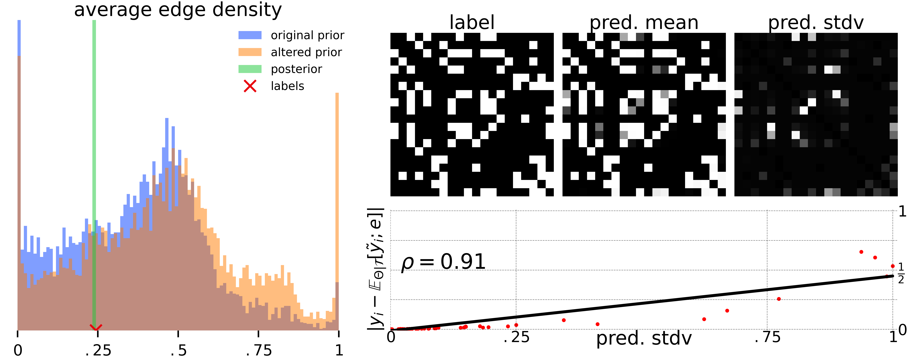

# Graph Structure Learning with Interpretable Bayesian Neural Networks

Repository containing code for the paper ["Graph Structure Learning with Interpretable Bayesian Neural Networks"](http://link-to-your-paper.com)

 

  
   
  <em>DPG: The Graph Structure Learning neural network with independently interpretable parameters.</em>

  

  
   
  <em>Bayesian Modeling Workflow.</em>

  

  
   
  <em>Visualizing Steps in the Bayesian Workflow: Predictive Checking.</em>

 

## Authors

- [Author Name](mailto:myemail@gmail.com) - for initial contributions
- Additional authors or contributors as they are added

## Setup

Refer to [Setting Up the Project Environment](docs/setup.md) for instructions on how to configure your local environment to run
